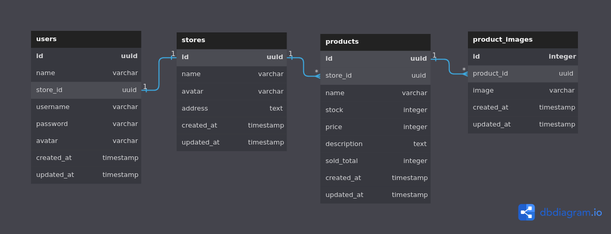

# RESTful API Tokopedia
buatlah RESTful API Tokopedia dengan design database dibawah. adapun ketentuan dalam membuat API sebagai berikut :

1. Buatlah Authentication & Atuhorization pada API Tokopedia ini.
2. User tidak bisa menambahkan product sebelum dia membuat toko (stores).
3. Pada saat membuat product, user harus memasukkan data product dan product imagesnya dalam 1 kali input sekaligus.
4. Tambahkan validasi untuk setiap input yang masuk di request body.

## Tugas ini akan berkelanjutan, usahakan buat projectnya dengan RAPI karena project ini akan ditambahkan fitur - fitur lanjutan yang akan mirip dengan sistemnya Tokopedia.

